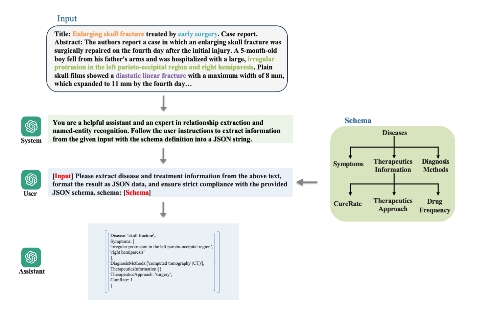

## Treatment corpus and schema-based instruction tuning for complex structured relation extraction from medical text

<div align="center">  

</div>

Official repo for **Treatment corpus and schema-based instruction tuning for complex structured relation extraction from medical text**

# :bar_chart: Dataset

We introduce the TreatCorpus dataset including ~2000 samples ([data](https://github.com/Yuz7/scMapNet/data/)) for training or evaluation in the task of structural complex relation extraction from medical text. The TreatCorpus was meticulously annotated through a combination of manual effort and LLM assistance. 

# 🔧Install environment

1. Create environment with conda:

```

conda create -n medllre python=3.12.3
conda activate medllre

```

2. Install dependencies

```

git clone https://github.com/Yuz7/medllre.git
cd medllre
pip install -r requirements.txt

```

# 🔧Model Training

We evaluate our schema-based tuning approach by fine tuning [LLaMA2-7B](https://huggingface.co/meta-llama/Llama-2-7b-hf) and [GPT-4o mini](https://platform.openai.com/docs/models/gpt-4o-mini) with LoRA, a parameter-efficient fine-tuning technique, on the TreatCorpus using cross validation. GPT-4o mini fine-tuning pipeline follows [the OpenAI guideline](https://platform.openai.com/docs/guides/supervised-fine-tuning), and the fine-tuning parameter uses [the defalut parameter](https://platform.openai.com/docs/api-reference/fine-tuning).


# 🌱Model fine-tuning

To fine-tuning Llama-2 on our dataset, please firstly downlowad [the Llama-2-7b weights](https://huggingface.co/meta-llama/Llama-2-7b-hf) or set your **huggingface key** in the head of finetuning.py.


1. run finetuning script on one fold data

```

python finetuning.py \
        --use_peft \
        --peft_method lora \
        --model_name 'meta-llama/Llama-2-7b-hf' \
        --output_dir './my_lora_weights/chat_cured/cured_chat_fold0' \
        --quantization \
        --batch_size_training 1 \
        --micro_batch_size 1 \
        --data_path 'data/chatbot_checked_cured/fold0' \
        --num_epochs 3 > log/train_cured_chat_fold0.log

``` 

1. run inference script to predict one fold data.

```

python inference.py \
    --base_model 'meta-llama/Llama-2-7b-hf' \
    --lora_weights './my_lora_weights/chat_cured/cured_chat_fold0/epoch_2' \
    --test_data_path 'data/chatbot_checked_cured/fold0/val.jsonl' \
    --results_dir './results_cured_checked_chat' \
    --trigger 'cured' \
    --fold 0 > log/test_checked_nochema_cured_chat_fold0.log 

```

# 🌱Model evaluation

We evaluate the performance of Llama-2 and GPT4o-mini using 5-folds cross validation on the TreatCorpus, and the evaluation pipeline is shown in the [results_eval.ipynb](https://github.com/Yuz7/scMapNet/results_eval.ipynb)

